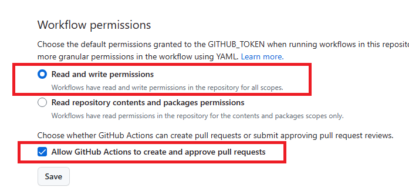

# Auto-Changelog & Julia Register Action

**JuliaRegisterChangelog** is a reusable GitHub Workflow for [Julia](https://julialang.org/) packages that automates the process of generating a changelog using [Conventional Commits](https://www.conventionalcommits.org/) and registering a new version of a Julia package with [JuliaRegistrator](https://github.com/JuliaRegistries/Registrator.jl).

This workflow is triggered in two scenarios:

* **On Push**: The action checks if the `version` field in `Project.toml` has changed.
* **On Manual Dispatch**: The action runs unconditionally, generating a changelog and commenting the latest commit (useful in case the registering process fails or you want to manually trigger it again).

## Usage

Create a workflow file at `.github/workflows/JuliaRegisterChangelog.yml` with the following contents:

```yaml
name: Auto-Changelog & Julia Register

on:
  workflow_dispatch:
  push:
    branches:
      - main
    paths:
      - Project.toml

jobs:
  release:
    runs-on: ubuntu-latest
    steps:
      - uses: alex180500/JuliaRegisterChangelog@v1
        with:
          github_token: ${{ secrets.GITHUB_TOKEN }}
```

Check that workflows have the correct permissions on your repo.



## How It Works

The process consists of:

1. Detect `Project.toml`version bumps following [Julia's own SemVer conventions](https://pkgdocs.julialang.org/v1/toml-files/#The-version-field).
2. Check if the version has changed since the last commit and proceed only if it has.
3. Generate a changelog automatically using [Conventional Commits](https://www.conventionalcommits.org/) and [conventional-changelog](https://github.com/conventional-changelog/conventional-changelog).
4. Trigger [JuliaRegistrator](https://github.com/JuliaRegistries/Registrator.jl) commenting on the latest commit to register the package and correctly formats the changelog.

## License

This package is distributed under [Apache-2.0 License](LICENSE). **This means that you can use the code freely for academic, personal, or commercial purposes!** _If you use my code extensively, I would greatly appreciate if you could credit me by linking my GitHub profile [`@alex180500`](https://github.com/alex180500) or just reference me in any way._
